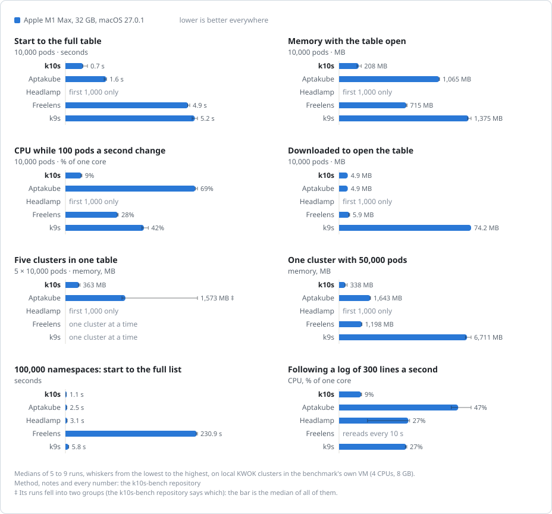

# Benchmarks

k10s and four other Kubernetes clients, measured on the same Mac, against the same clusters, with the same steps. Everything here comes from [this repository](..), and you can repeat it on your own Mac with one command: see its [README](../README.md). Nobody touches the Mac while it runs: the benchmark starts and drives every client itself.

Lens isn't among them: it works only after signing in to a Lens ID. Freelens, its open source fork, is the same app underneath; the benchmark can measure Lens too (`--clients lens`) if you sign in.

If something here is wrong or unfair to one of the clients, please [open an issue](../../../issues/new/choose).

## What is measured

Each client opens one screen, the way a person would, and is watched from the outside. Nothing is added to any client, k10s included.

| | How |
| --- | --- |
| **Start to a window** | From the launch to the app's first window on screen. Desktop apps are launched through LaunchServices, as the Dock does. |
| **Start to the full table** | From the launch until the screen shows every object. Where the benchmark can read the window (Freelens and Headlamp through the DevTools protocol, k9s through its terminal), that is when it shows the expected count. k10s's and Aptakube's windows can't be read from outside: for them it is when the data is in and the window is up. The data is in when the bytes from the API servers, counted by a proxy in 10 ms steps, reach 30 bytes per object and then pause for a second. That is the earliest the table can show, so it favors k10s and Aptakube. By how much is in the tables: for the clients whose window can be read, the row under it is the time from the data being in to the window showing it. |
| **Memory** | The sum of `phys_footprint` (Activity Monitor's "Memory" column) over every process of the app: Electron's helpers and renderers, Headlamp's own server, and the WebKit processes that draw a WKWebView (Tauri apps). The median over 30 seconds, from 20 seconds after the table is ready, but not before the app is 45 seconds old: an app that is ready early would otherwise be measured younger, still filling caches, than the others. Most apps hold steady from then on; Freelens's memory still falls until about 90 seconds, and Headlamp's grows by some 10 MB a minute, so every run is measured at the same age. |
| **Memory, highest** | The highest memory from the launch to those 30 seconds (each sample the median of three in a row, so that one odd sample doesn't count). |
| **CPU** | The CPU time of all those processes over the same 30 seconds, in % of one core. |
| **Downloaded** | Bytes from the API servers to the app until 5 seconds after the table is ready. A proxy in front of each API server counts them (TLS passes through it untouched). This is what a client costs on a VPN to a remote data center. |
| **API requests** | Requests the app sent, from the API server's audit log. Every run connects as a user of its own (a client certificate made for it), so the log tells its requests from everyone else's; the log is read after a marker request of the benchmark's shows up in it, so that none is missed. This is the load a client puts on your API servers. |
| **Under churn** | Right after those 30 seconds, 1,000 of the pods start to change, 100 updates a second on a fixed schedule: their restart count goes up, which every client shows. CPU and memory over 30 seconds, after 10 seconds of it. A run in which the updates fell short of the rate is measured again. |
| **Following a log** | One pod writes 300 JSON lines a second, and the client follows its log for a minute: from 10 seconds after it shows the log, and not before the app is 45 seconds old. CPU, memory over the last 20 seconds of that minute, and how fast it grew (the trend of one-second medians, in MB a minute). k10s and Aptakube show the log when their traffic carries it at the pod's rate for 8 seconds in a row. Then, for 12 seconds, how far behind the pod the window shows the log: the newest line on screen against the newest the pod wrote, every 250 ms, where the benchmark can read the window (Freelens and Headlamp, over DevTools). |

Each client gets 4 minutes to show the table; a run that doesn't counts as failed.

## How the runs go

- **Nobody at the Mac.** The benchmark drives every client: through settings written before it starts (k10s, Aptakube), the DevTools protocol (Freelens, Headlamp), or its command line in a pseudo-terminal (k9s). For the log, k10s reopens the pod's log because it was open when the app last quit, a feature of k10s itself (it reopens what you had open), and the benchmark writes that into its settings; Aptakube opens the pod's log from a link (`aptakube://`).
- **The same start every time.** In each scenario every client first starts once without being counted: macOS checks the app, and its caches fill. Its profile (its home folder, with settings and caches) is then saved, as an APFS clone, and put back before every counted run. So nothing one run changes reaches the next: a page size, a sort, a panel left open. A fingerprint of each client's settings is recorded with every run to prove it.
- **Turns.** The clients take turns in rounds, in an order shuffled for every round from a seed recorded in the results. A client never starts a round right after it ended the one before, so no client always meets the Mac warm from itself.
- **As many runs as it takes.** At least 5 per client and scenario, and up to 9 while the median isn't known well enough: until the range that holds the true median with about 90 % certainty (from the runs' order statistics) is within 10 % of it, or within 0.2 s, 15 MB or 1 point of CPU where that is more. That goes for the time to the table, idle memory and idle CPU, and for the churn and log numbers in their scenarios.
- **A quiet Mac.** The benchmark watches the whole Mac every 250 ms. Before each scenario it measures what keeps the Mac busy while nothing is measured (other apps, macOS itself): that level is part of the Mac, and each Mac's notes say what it was. Before each start it waits until the Mac is no busier than that. A run is *noisy* if, once the app had started, something else used more than a quarter of a core above that level (or two cores for a second), the Mac was hot, short of memory or on battery, the display slept, or the app's window wasn't in front (k9s, in a terminal, excepted). The start itself isn't judged by what else ran: macOS does a core or two of work for any app that launches (its signature, LaunchServices, the Dock). Noisy runs are kept in the results and measured again, up to 4 times per client and scenario. The tables leave them out, and each table's "Runs" row counts them.
- **The right screen.** Every run is checked against the API server's audit log: the pods screen must list and watch the pods of every cluster in the scenario, the namespaces screen the namespaces, the 100-context scenario must open exactly one of its clusters, and the log scenario must get at least half of the log. A run that showed something else is left out, and the notes under the table say so.

## The clusters

The clusters are [KWOK](https://kwok.sigs.k8s.io) clusters: a real kube-apiserver and etcd (Kubernetes 1.36), with nodes and pods that KWOK simulates instead of a kubelet. To the clients they are ordinary clusters. They run in a virtual machine of the benchmark's own, the same on every Mac: [colima](https://github.com/abiosoft/colima) on Apple's Virtualization framework, with 4 CPUs and 8 GB. It runs nothing else, and it leaves Docker Desktop and other VMs alone. Each scenario starts only its own clusters, and reads their lists once before the first start, so that every client finds the API servers' caches warm.

They are filled the way a busy cluster looks: Deployments in many namespaces, 200 pods per namespace in workloads of 8 to 40 replicas, about 100 pods per node, a sidecar in a third of the workloads, environment variables, probes and resource limits. The controller manager creates the ReplicaSets and pods and the scheduler binds them, so the objects carry the same fields and `managedFields` as real ones (about 6 KB of JSON per pod).

The log scenario uses a k3s cluster instead, because KWOK's pods don't run anything: a busybox container writes the log. Inside the VM, the kubelet reads the container's log file about once a second (it doesn't hear of each write there), so every client gets the log in batches of about 300 lines a second, a second apart; on a real node lines come as they are written.

## Scenarios

| Scenario | |
| --- | --- |
| `pods-1k` | Pods in all namespaces of one cluster with 1,000 pods |
| `pods-10k` | The same with 10,000 pods, and then 100 pod updates a second |
| `pods-50k` | The same with 50,000 pods |
| `fleet-5x10k` | Pods of five clusters with 10,000 pods each, in one table. Only for clients that show several clusters in one table: k10s, Aptakube and Headlamp |
| `namespaces-100k` | The namespaces of a cluster with 100,000 of them |
| `contexts-100` | A kubeconfig with 100 contexts, one cluster of 1,000 pods open. The 100 contexts have addresses of their own, all served by one API server |
| `logs-300` | Following the log of one pod that writes 300 lines a second |

## Fairness

- **Latest versions**, pinned in [clients.lock.json](../clients.lock.json) with their SHA-256, so that every machine measures the same builds. k10s is its release, or a build from a k10s checkout; the tables say which, with the commit of a build.
- **Default settings**, no plugins or extensions. Each client runs in a profile of its own (its own home folder), made fresh for every benchmark run, and sees only the benchmark's kubeconfig. Aptakube too: the benchmark copies its trial or licence file into that profile, and never touches the person's own.
- **The same window.** Desktop apps get k10s's default window size, 1440×900 points, in the middle of the main display: written into their saved window state before they start (k10s, Aptakube, Freelens), or set over DevTools (Headlamp, which otherwise sizes itself to the screen). More rows on screen cost more. Every run records each app's windows; one of another size, or a second window, is in the notes.
- **k9s** runs in a 200×50 pseudo-terminal. The terminal app that would draw it in real life is not counted, which favors k9s.
- **Headlamp** lists 1,000 objects at a time and loads more when asked. It is measured as it ships, so its numbers for 10,000 pods and more are for the first 1,000 of them: the tables below keep them and say so, and the README and the charts leave them out, as they don't compare.
- **Freelens** doesn't follow a log as it's written: it reads it again every 10 seconds, so the lines it shows are up to 10 seconds old. Its CPU while following the log is for that lighter work: the tables keep it, and the README and the charts leave it out.
- **Ready** isn't read the same way for everyone (see *Start to the full table*): the difference favors k10s and Aptakube, and the tables show how much it is for the others.

## What it doesn't tell you

- How the clients feel to use: features, design, keyboard. That is in k10s's README, in its [comparison](../../../../k10s#how-it-compares).
- Linux and Windows. The benchmark runs on macOS only, and k9s, Freelens and Headlamp behave differently elsewhere.
- Clusters far away. The API servers are local, so times leave out the network: on a VPN, the downloaded megabytes matter more than the seconds here.
- Very large objects, CRDs, metrics. The clusters have no metrics-server, so no client polls metrics.

## Repeatability

Repeated runs on one Mac should agree: in at least 9 of 10 cells (a client's number in a scenario) the medians of two full runs are within 10 % of each other, or within the floors above, none is off by more than twice that, and the cells that miss are those whose runs fall into two groups (marked ‡). `node bench.mjs compare a.json b.json` checks two results files against that.

<!-- repeatability -->

## Results

Every number below is the median of the clean runs in [results](../results), with the lowest and the highest of them under it in small type; ‡ marks a cell whose runs fell into two groups, and the note under its table says which. Lower is better everywhere. Each Mac gets its own tables: compare the clients within one Mac, not the Macs. The chart above shows every Mac; the table in the README is from the one named under it.

<!-- results -->

### Apple M1 Max, 32 GB, macOS 27.0.1

Clients: k10s 0.1.0 (1a3011f), Aptakube 1.21.1, Headlamp 0.45.0, Freelens 1.10.3, k9s 0.51.0.

- The clusters ran in the benchmark's own VM: colima 0.10.3 (vz, virtiofs), 4 CPUs and 7.7 GB; KWOK 0.8.0.
- Display 1728 × 1117 points at 2×, and every app's window 1440 × 900.
- Aptakube: 2 windows in 16 of 49 runs.
- With nothing measured, the rest of the Mac (other apps, macOS) kept 11–64 % of a core busy; each scenario's runs were judged against its own level.
- Aptakube ran in a profile of the benchmark's own, on its trial.

#### Pods of one cluster, 1,000 pods

| | **k10s** | **Aptakube** | **Headlamp** | **Freelens** | **k9s** |
| --- | --- | --- | --- | --- | --- |
| Start to the full table | 0.6 s 0.5–0.6 | 0.9 s 0.7–0.9 | 1.6 s 1.4–1.7 | 3.3 s 3.3–3.4 | 3.0 s 2.9–3.2 |
| …after the data was in, until the window showed it | – | – | 0.1 s | 0.2 s | 2.2 s 2.2–2.3 |
| Start until it stops working on it | 0.6 s 0.5–5.5 | 1.1 s 1.0–1.2 | 1.7 s 1.5–1.7 | 3.4 s 3.3–3.4 | 6.0 s 2.9–11.2 |
| Start to a window | 0.3 s 0.3–0.4 | 0.4 s | 0.5 s 0.5–0.6 | 1.1 s 1.0–1.2 | – |
| Downloaded to open it | 0.5 MB | 0.5 MB | 0.5 MB | 1.4 MB | 7.4 MB |
| API requests to open it | 8 | 6 | 20 | 62 | 15 13–15 |
| Memory, idle | 169 MB 169–170 | 389 MB 389–390 | 267 MB 265–270 | 591 MB 581–596 | 173 MB 169–176 |
| Memory, highest while loading | 263 MB 259–276 | 580 MB 547–587 | 371 MB 364–394 | 980 MB 970–1,005 | 173 MB 169–176 |
| CPU, idle | 0.9% 0.9–1.0 | 0.3% | 3.4% 3.2–3.7 | 2.3% 2.2–2.4 | 7.7% 7.4–8.1 |
| API requests a minute, idle | 4 | 0 | 36 34–36 | 8 | 4 |
| Runs | 5 · 1 noisy | 5 | 9 | 5 | 8 · 1 noisy |

#### Pods of one cluster, 10,000 pods

| | **k10s** | **Aptakube** | **Headlamp** | **Freelens** | **k9s** |
| --- | --- | --- | --- | --- | --- |
| Start to the full table | 0.7 s 0.7–0.9 | 1.6 s 1.6–1.7 | 1.6 s 1.4–1.7 | 4.9 s 4.9–5.0 | 5.2 s 5.1–5.3 |
| …after the data was in, until the window showed it | – | – | 0.1 s | 1.2 s | 1.1 s 1.0–1.2 |
| Start until it stops working on it | 0.8 s 0.7–1.0 | 3.9 s 3.6–3.9 | 1.7 s 1.4–1.8 | 5.0 s 5.0–5.1 | – |
| Start to a window | 0.3 s 0.3–0.4 | 0.4 s | 0.6 s 0.5–0.6 | 1.1 s 1.1–1.2 | – |
| Downloaded to open it | 4.9 MB | 4.9 MB | 0.6 MB | 5.9 MB 5.5–6.0 | 74.2 MB |
| API requests to open it | 12 | 9 | 20 | 107 | 15 13–15 |
| Memory, idle | 208 MB 191–236 | 1,065 MB 1,064–1,068 | 270 MB 266–271 | 715 MB 714–723 | 1,375 MB 1,366–1,403 |
| Memory, highest while loading | 297 MB 272–333 | 1,401 MB 1,289–1,445 | 368 MB 363–400 | 1,461 MB 1,451–1,496 | 1,375 MB 1,351–1,402 |
| CPU, idle | 1.3% 1.1–1.5 | 0.3% | 3.6% 3.4–3.7 | 2.4% 2.3–2.5 | 40.0% 38.5–40.5 |
| API requests a minute, idle | 4 | 0 | 34 34–36 | 8 | 4 4–8 |
| CPU while 100 pods a second change | 9% 8–9 | 69% 69–70 | 2% | 28% | 42% 41–44 |
| Memory while 100 pods a second change | 210 MB 196–231 | 1,122 MB 1,113–1,125 | 283 MB 281–286 | 763 MB 754–765 | 1,431 MB 1,419–1,444 |
| Runs | 9 · 2 noisy | 5 | 9 · 1 noisy | 5 | 6 |

- Headlamp loads the first 1,000 objects of each cluster and more when you ask: its numbers are for those.

#### Pods of one cluster, 50,000 pods

| | **k10s** | **Aptakube** | **Headlamp** | **Freelens** | **k9s** |
| --- | --- | --- | --- | --- | --- |
| Start to the full table | 2.3 s 1.5–2.5 | 6.4 s 6.2–6.7 | 1.7 s 1.6–1.7 | 12.1 s 11.7–12.4 | 19.9 s 19.7–20.0 |
| …after the data was in, until the window showed it | – | – | – | 5.5 s 5.4–5.7 | 1.3 s 1.2–1.4 |
| Start until it stops working on it | 2.4 s 1.6–2.6 | 9.3 s 9.2–9.8 | 1.8 s 1.7–1.8 | 12.2 s 11.8–12.4 | – |
| Start to a window | 0.3 s | 0.4 s | 0.6 s 0.6–0.7 | 1.4 s 1.1–1.4 | – |
| Downloaded to open it | 24.3 MB | 24.3 MB 24.2–24.3 | 0.5 MB | 24.8 MB 24.6–25.1 | 370.6 MB |
| API requests to open it | 29 | 29 | 20 | 299 297–308 | 16 |
| Memory, idle | 338 MB 311–426 | 1,643 MB 1,633–1,653 | 267 MB 265–274 | 1,198 MB 1,188–1,205 | 6,711 MB 6,628–6,926 |
| Memory, highest while loading | 420 MB 393–594 | 4,965 MB 4,933–4,990 | 383 MB 374–398 | 3,626 MB 3,618–3,648 | 6,616 MB 6,159–6,914 |
| CPU, idle | 1.3% 1.2–1.9 | 0.8% | 3.4% 3.4–3.6 | 2.4% 2.1–4.8 | 152.0% 149.7–157.6 |
| API requests a minute, idle | 4 | 0 | 34 34–36 | 8 | 4 |
| Runs | 9 · 1 noisy | 7 | 6 | 7 | 5 · 2 failed |

- Headlamp loads the first 1,000 objects of each cluster and more when you ask: its numbers are for those.
- k9s failed 2 of its 7 runs, left out of its numbers: k9s did not show 50,000 within 240 s.

#### Pods of five clusters in one table, 10,000 pods each

| | **k10s** | **Aptakube** | **Headlamp** | **Freelens** | **k9s** |
| --- | --- | --- | --- | --- | --- |
| Start to the full table | 2.3 s 1.6–2.5 | 2.5 s 2.1–2.8 | 1.5 s 1.3–1.7 | one cluster at a time | one cluster at a time |
| Start until it stops working on it | 2.4 s 1.6–2.5 | 4.5 s 4.1–8.5 | 8.4 s 1.7–8.7 | one cluster at a time | one cluster at a time |
| Start to a window | 0.3 s 0.3–0.4 | 0.4 s | 0.6 s 0.5–0.7 | one cluster at a time | one cluster at a time |
| Downloaded to open it | 24.4 MB 24.3–24.4 | 24.2 MB 24.2–24.3 | 0.7 MB | one cluster at a time | one cluster at a time |
| API requests to open it | 60 | 45 | 89 88–91 | one cluster at a time | one cluster at a time |
| Memory, idle | 363 MB 341–383 | 1,573 MB 1,484–3,467 ‡ | 296 MB 287–306 | one cluster at a time | one cluster at a time |
| Memory, highest while loading | 450 MB 428–477 | 4,383 MB 3,873–4,557 | 434 MB 415–449 | one cluster at a time | one cluster at a time |
| CPU, idle | 1.2% 1.1–1.3 | 1.0% 0.9–1.0 | 6.0% 5.6–6.9 | one cluster at a time | one cluster at a time |
| API requests a minute, idle | 20 | 0 | 172 162–172 | one cluster at a time | one cluster at a time |
| Runs | 9 | 9 | 9 · 1 noisy |  |  |

- ‡ Aptakube, memory, idle: 1,521 MB in 6 runs, 3,429 MB in 3 runs.
- Headlamp loads the first 1,000 objects of each cluster and more when you ask: its numbers are for those.

#### Namespaces of one cluster, 100,000 namespaces

| | **k10s** | **Aptakube** | **Headlamp** | **Freelens** | **k9s** |
| --- | --- | --- | --- | --- | --- |
| Start to the full table | 1.1 s 1.0–1.1 | 2.5 s 2.4–2.6 | 3.1 s 2.9–3.1 | 230.9 s 230.0–232.2 | 5.8 s 5.5–5.9 |
| …after the data was in, until the window showed it | – | – | 1.2 s | 12.0 s 11.6–12.1 | 1.1 s 1.0–1.2 |
| Start until it stops working on it | 1.2 s 1.1–1.5 | 4.5 s 4.4–4.7 | 3.1 s 2.9–3.2 | 232.3 s 231.2–233.5 | – |
| Start to a window | 0.3 s | 0.5 s | 0.5 s 0.4–0.5 | 1.1 s 1.1–1.2 | – |
| Downloaded to open it | 4.4 MB | 8.8 MB | 4.4 MB | 94.2 MB | 65.9 MB |
| API requests to open it | 9 | 105 | 15 | 100,050 | 15 |
| Memory, idle | 342 MB 335–357 | 1,487 MB 1,475–1,734 | 628 MB 625–636 | 845 MB 841–852 | 1,165 MB 1,152–1,178 |
| Memory, highest while loading | 490 MB 468–497 | 1,711 MB 1,683–1,929 | 810 MB 791–826 | 1,650 MB 1,623–1,670 | 1,301 MB 1,296–1,331 |
| CPU, idle | 1.0% 0.9–1.1 | 0.4% 0.3–0.6 | 1.0% 1.0–1.3 | 1.9% 1.8–2.0 | 68.1% 67.4–69.4 |
| API requests a minute, idle | 2 | 0 | 16 | 2 | 4 |
| Runs | 5 | 7 | 7 | 5 | 5 |

#### Following one pod's log, 300 lines a second

| | **k10s** | **Aptakube** | **Headlamp** | **Freelens** | **k9s** |
| --- | --- | --- | --- | --- | --- |
| CPU while following the log | 9% | 47% 44–52 | 27% 11–28 | 4% | 27% 26–27 |
| Memory after a minute of the log | 260 MB 251–306 | 819 MB 769–836 | 384 MB 373–405 | 571 MB 563–588 | 69 MB 67–70 |
| Memory growth while following it, a minute | 17.5 MB -7.2 to 33.5 | -7.2 MB -63.5 to 24.2 | 12.9 MB 8.2–33.2 | -26.5 MB -40.3 to -16.6 | 2.0 MB -0.3 to 3.4 |
| How far behind the pod it shows the log, usually | – | – | 1 s | 4 s | – |
| …and at most | – | – | 1 s | 10 s | – |
| Runs | 9 | 9 | 7 | 5 · 1 noisy | 5 |

- Freelens doesn't follow the log as it comes: it reads it again every few seconds, and shows lines up to 10 s old. Its CPU is for that.
- How far behind the log shows is read from the windows the benchmark can read (over DevTools); k10s's and Aptakube's can't be read, and k9s draws its terminal in partial redraws.

#### One cluster (1,000 pods) out of a kubeconfig with 100 contexts

| | **k10s** | **Aptakube** | **Headlamp** | **Freelens** | **k9s** |
| --- | --- | --- | --- | --- | --- |
| Start to the full table | 0.6 s 0.5–0.6 | 0.8 s 0.8–0.9 | 1.6 s 1.4–1.6 | 3.4 s 3.3–3.4 | 3.1 s 2.9–3.1 |
| …after the data was in, until the window showed it | – | – | 0.1 s | 0.2 s | 2.2 s 2.2–2.3 |
| Start until it stops working on it | 0.6 s 0.5–0.6 | 1.1 s 1.0–1.2 | 5.7 s 5.6–8.4 | 3.4 s | 5.1 s 3.1–7.1 |
| Start to a window | 0.3 s 0.3–0.4 | 0.4 s | 0.5 s 0.5–0.6 | 1.1 s 1.1–1.2 | – |
| Downloaded to open it | 0.5 MB | 0.5 MB | 0.8 MB | 1.0 MB 0.9–1.1 | 7.4 MB |
| API requests to open it | 8 | 6 | 119 | 61 60–62 | 15 13–15 |
| Memory, idle | 171 MB 169–171 | 392 MB 390–394 | 288 MB 283–296 | 599 MB 595–605 | 172 MB 170–174 |
| Memory, highest while loading | 267 MB 236–267 | 575 MB 548–583 | 418 MB 397–422 | 1,053 MB 1,009–1,120 | 176 MB 170–179 |
| CPU, idle | 0.9% 0.9–1.4 | 0.3% 0.2–0.3 | 3.6% 3.5–4.3 | 2.3% 2.3–2.5 | 7.8% 7.3–8.1 |
| API requests a minute, idle | 4 | 0 | 234 232–234 | 8 | 4 |
| Runs | 5 | 6 · 1 noisy | 9 | 5 | 7 |

<!-- /results -->
